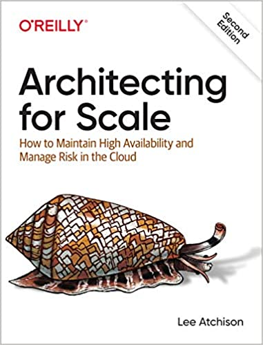
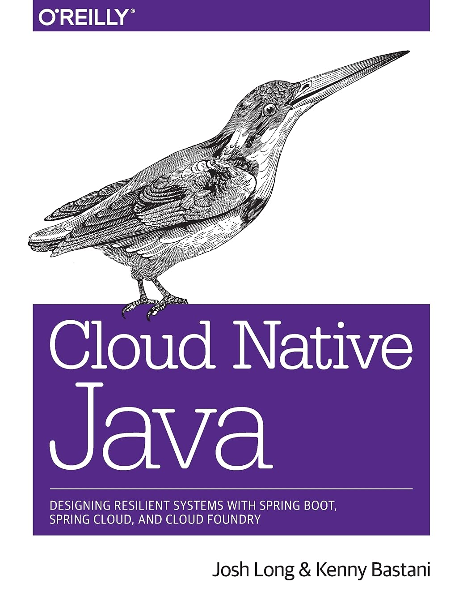
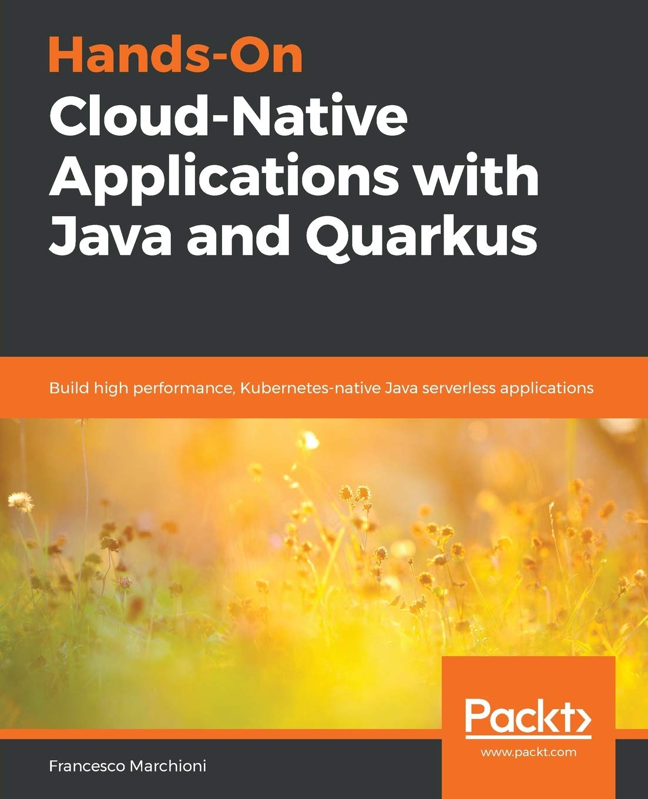
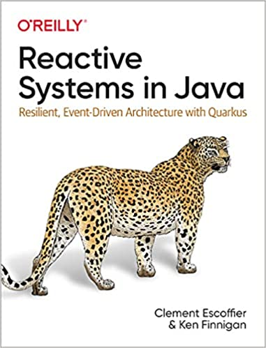
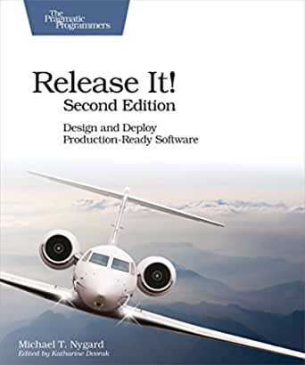
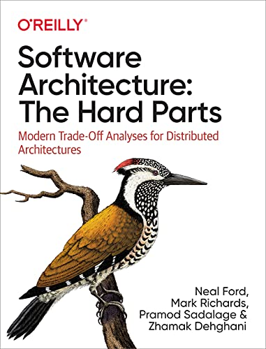

# TDC Business São Paulo 2022
## Session - Resilient Architectures in Java

Speaker: [Leonardo Piedade](https://bit.ly/linkedin-leoap)

Presentation Deck: [here](https://bit.ly/tdcsp-2022-deck)

---
## Blog Posts
* [Akka Streams Backpressure](https://blog.rockthejvm.com/akka-streams-backpressure/)
* [Guide to Microservices Resilience Patterns](https://www.jrebel.com/blog/microservices-resilience-patterns)
* [Resilience design patterns: retry, fallback, timeout, circuit breaker](https://blog.codecentric.de/en/2019/06/resilience-design-patterns-retry-fallback-timeout-circuit-breaker/)
* [Resilience Patterns in Spring Boot with Resilience4j: Part 1 — Circuit Breaker](https://medium.com/cloudnesil/resilience-patterns-in-spring-boot-with-resilience4j-part-1-circuit-breaker-5a49b6b1b100)

## Books

&nbsp; &nbsp; &nbsp; [Architecting for Scale - Lee Atchison](https://www.amazon.com/Architecting-Scale-Maintain-Availability-Manage/dp/1492057177/)

&nbsp; &nbsp; &nbsp; Every day, companies struggle to scale critical applications. As traffic volume and data demands increase, these applications become more complicated and brittle, exposing risks and compromising availability. With the popularity of software as a service, scaling has never been more important.

 
 
 

&nbsp; &nbsp; &nbsp; [Cloud Native Java: Designing Resilient Systems with Spring Boot](https://www.amazon.com/Cloud-Native-Java-Designing-Resilient/dp/1449374646/)

&nbsp; &nbsp; &nbsp; What separates the traditional enterprise from the likes of Amazon, Netflix, and Etsy? Those companies have refined the art of cloud native development to maintain their competitive edge and stay well ahead of the competition. This practical guide shows Java/JVM developers how to build better software, faster, using Spring Boot, Spring Cloud, and Cloud Foundry.

 
 
 

&nbsp; &nbsp; &nbsp; [Hands-On Cloud-Native Applications with Java and Quarkus](https://www.amazon.com/Hands-Cloud-Native-Applications-Quarkus-Kubernetes-native/dp/1838821473/)

&nbsp; &nbsp; &nbsp; Quarkus is a new Kubernetes-native framework that allows Java developers to combine the power of containers, microservices, and cloud-native to build reliable applications. The book is a development guide that will teach you how to build Java-native applications using Quarkus and GraalVM.

 
 
 

&nbsp; &nbsp; &nbsp; [Reactive Systems in Java](https://www.amazon.com/Reactive-Systems-Java-Clement-Escoffier-ebook/dp/B09LKR8VSG/)

&nbsp; &nbsp; &nbsp; Reactive systems and event-driven architecture are becoming indispensable to application design, and companies are taking note. Reactive systems ensure that applications are responsive, resilient, and elastic no matter what failures or errors may be occurring, while event-driven architecture offers a flexible and composable option for distributed systems. This practical book helps Java developers bring these approaches together using Quarkus 2.x, the Kubernetes-native Java framework.

 
 
 

&nbsp; &nbsp; &nbsp; [Release It! - Michael T. Nygard](https://www.amazon.com/Release-Design-Deploy-Production-Ready-Software/dp/1680502395/)

&nbsp; &nbsp; &nbsp; A single dramatic software failure can cost a company millions of dollars - but can be avoided with simple changes to design and architecture. This is a must-have pragmatic guide to engineering for production systems.

 
 
 

&nbsp; &nbsp; &nbsp; [Software Architecture: The Hard Parts](https://www.amazon.com/Software-Architecture-Trade-Off-Distributed-Architectures/dp/1492086894/)

&nbsp; &nbsp; &nbsp; There are no easy decisions in software architecture. Instead, there are many hard parts--difficult problems or issues with no best practices--that force you to choose among various compromises. With this book, you'll learn how to think critically about the trade-offs involved with distributed architectures.

 
 
 

## Java Frameworks

* [Akka](https://akka.io/)
* [Failsafe](https://failsafe.dev/)
* [Resilience4j](https://resilience4j.readme.io/)
* [Spring Boot](https://spring.io/projects/spring-boot)

## Presentations
* [Patterns of Resilience](https://www.slideshare.net/ufried/patterns-of-resilience)

